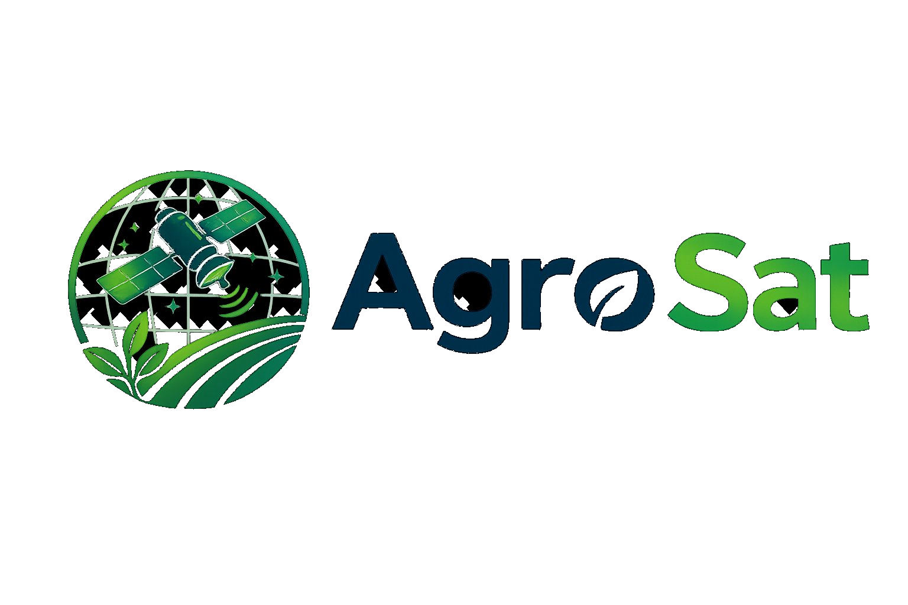

<p align="center">
  
</p>

<h1 align="center">AgroSat — Monitoramento e Risco Agrícola via Satélite</h1>

<p align="center">
  
  
  
  
  
</p>

<p align="center">
  <strong>Global Solution 2026/1 · FIAP · 1TDS Agosto</strong>
</p>

---

## 📋 Sobre o Projeto

O **AgroSat** é uma plataforma SPA de monitoramento agrícola que integra dados satelitais reais da **NASA POWER**, **INPE TerraBrasilis**, **Copernicus ESA** e **Open-Meteo** com modelos de **Machine Learning (Random Forest)** para monitoramento de risco hídrico e saúde da vegetação em regiões agrícolas brasileiras.

O problema que resolvemos: produtores rurais não têm acesso fácil e centralizado a dados satelitais para tomar decisões rápidas sobre irrigação, manejo e prevenção de perdas. O AgroSat automatiza esse processo gerando alertas inteligentes por região com até 7 dias de antecipação.

### Funcionalidades principais

- 🗺 **Dashboard** — mapa interativo com status em tempo real de todas as regiões cadastradas
- 📡 **Monitoramento por Região** — histórico de leituras satelitais (NDVI, temperatura, umidade)
- 🔔 **Alertas Inteligentes** — gerados automaticamente pelo pipeline de ML com níveis BAIXO / MÉDIO / ALTO / CRÍTICO
- 🤖 **Simulador IA** — previsão de risco hídrico sob demanda com Random Forest
- 🔥 **Queimadas** — integração com NASA FIRMS para focos de calor em tempo real
- 📊 **Comparativo** — análise lado a lado entre regiões
- ⚙️ **Gerenciar** — CRUD completo de regiões e usuários via API Java

---

## 🧰 Tecnologias

| Camada | Tecnologia |
|--------|-----------|
| Frontend | React 19 + Vite 5 + TypeScript 5 |
| Roteamento | React Router DOM 7 — SPA com rotas estáticas + dinâmica `/regioes/:id` |
| Estilização | Tailwind CSS 3 (exclusivo, sem frameworks externos) |
| Acessibilidade | VLibras |
| Backend Java | Java 21 + Quarkus 3.8.4 — hospedado no Render |
| IA / ML | Python 3 + Flask + scikit-learn — hospedado no Render |
| Banco de Dados | Oracle SQL (FIAP Cloud) |
| Deploy Frontend | Vercel |
| Email | EmailJS |

---

## 📁 Estrutura de Pastas

```
FrontEnd/
├── public/                  Imagens, fotos dos integrantes, logos
├── src/
│   ├── components/          Navbar · Footer · Modal · Ui · VLibras · NotifDropdown
│   ├── context/             AppContext · NotifContext  (estado global com useContext)
│   ├── data/                mockData.ts (fallback) · brazilMap.ts
│   ├── pages/               15 páginas:
│   │                        Home, Dashboard, RegiaoDetalhe (/regioes/:id),
│   │                        Alertas, Clima, SimuladorIA, Comparativo, Queimadas,
│   │                        Pipeline, Planos, Gerenciar, Sobre, FAQ, Contato, Integrantes
│   ├── services/            api.ts (Java + Flask) · openMeteo.ts · firmsApi.ts
│   └── types/               index.ts — interfaces, union types e intersection types
├── .env                     Variáveis de ambiente (URLs das APIs)
├── tailwind.config.js
├── vite.config.ts
└── package.json
```

---

## 🗄 Integração com API Java (DDD)

A API Java cobre as seguintes entidades, todas consumidas via `fetch` com os verbos HTTP corretos:

| Tabela Oracle | Operações | Página |
|---------------|-----------|--------|
| TB_REGIAO | GET · POST · PUT · DELETE | Dashboard, RegiaoDetalhe, Gerenciar |
| TB_LEITURA_SATELITAL | GET · POST | RegiaoDetalhe |
| TB_PREVISAO | GET · POST | RegiaoDetalhe |
| TB_ALERTA | GET · PUT (resolver) | Alertas |
| TB_HISTORICO_ALERTA | GET | Alertas |
| TB_USUARIO | GET · POST · PUT · DELETE | Gerenciar |
| TB_FONTE_SATELITAL | GET | Gerenciar |
| TB_REGIAO_USUARIO | GET · POST · DELETE | Gerenciar |

---

## 👥 Autores

| Foto | Nome | RM | Turma | Papel | Links |
|------|------|----|-------|-------|-------|
|  | Gustavo Rodrigues Siciliano | RM568419 | 1TDS Agosto | Full-Stack Developer | [GitHub](https://github.com/GustavoSiciliano) · [LinkedIn](https://www.linkedin.com/in/gustavo-rodrigues-siciliano) |
|  | Gustavo de Jesus Silva | RM567926 | 1TDS Agosto | Backend & Database | [GitHub](https://github.com/GustavoJesusSilva) · [LinkedIn](https://www.linkedin.com/in/gustavo-de-jesus-silva) |
|  | Samuel Keniti Kina de Lima | RM567614 | 1TDS Agosto | AI & ML Engineer | [GitHub](https://github.com/SamuelKeniti) · [LinkedIn](https://www.linkedin.com/in/samuel-keniti-kina-de-lima) |

---

## 🚀 Como Usar

### Instalação local

```bash
git clone https://github.com/GustavoSiciliano/Global-Solution-2026
cd Global-Solution-2026/FrontEnd
npm install
npm run dev
```

### Variáveis de ambiente

Crie um arquivo `.env` na raiz de `/FrontEnd` com:

```env
VITE_JAVA_API_URL=https://global-solution-2026.onrender.com
VITE_FLASK_API_URL=https://gs-ia.onrender.com
```

### Build para produção

```bash
npm run build
# Output em /dist — conectar repositório diretamente na Vercel
# Root: FrontEnd | Build Command: npx vite build | Output Directory: dist
```

---

## 🔗 Links

| Recurso | URL |
|---------|-----|
| 📁 Repositório GitHub | https://github.com/GustavoSiciliano/Global-Solution-2026 |
| 🎬 Vídeo YouTube | https://youtu.be/prsl2J08fCo |
| 🌐 Deploy Vercel | https://agrosat.vercel.app |
| ☕ API Java (Render) | https://global-solution-2026.onrender.com |
| 🤖 API Flask IA (Render) | https://gs-ia.onrender.com |
| 📋 Trello | https://trello.com/b/y3VQzMc5/agrosat |

---

## 📞 Contato

Abra uma [issue no GitHub](https://github.com/GustavoSiciliano/Global-Solution-2026/issues) ou entre em contato pelo LinkedIn dos integrantes acima.

---

<p align="center">
  <em>FIAP · Global Solution 2026/1 · A Economia Espacial</em>
</p>
